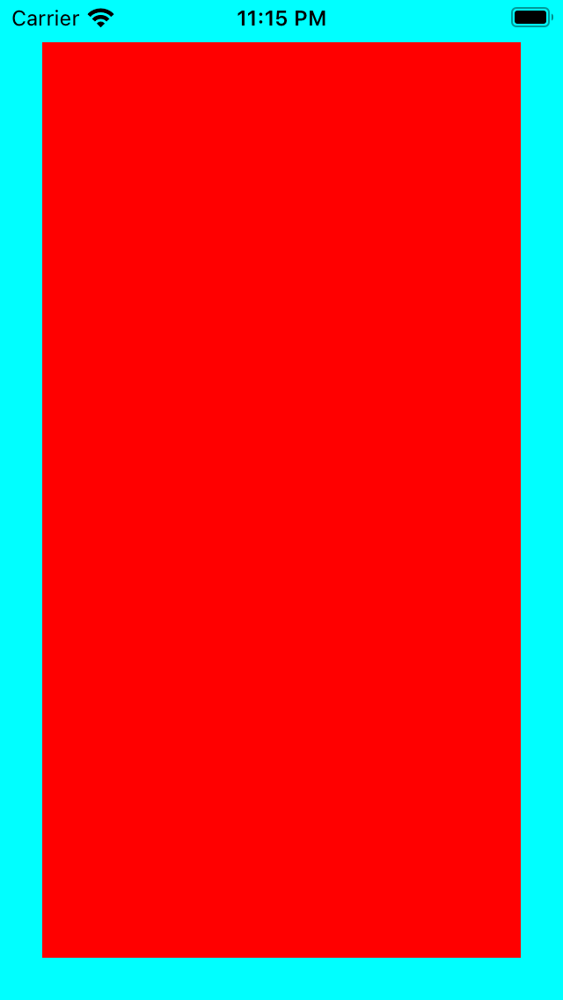
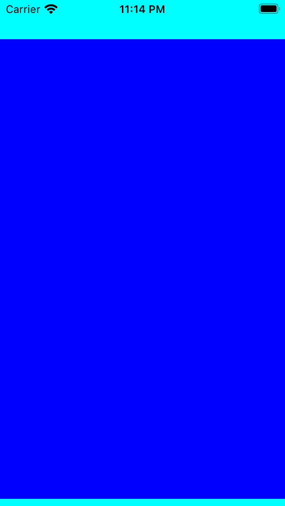
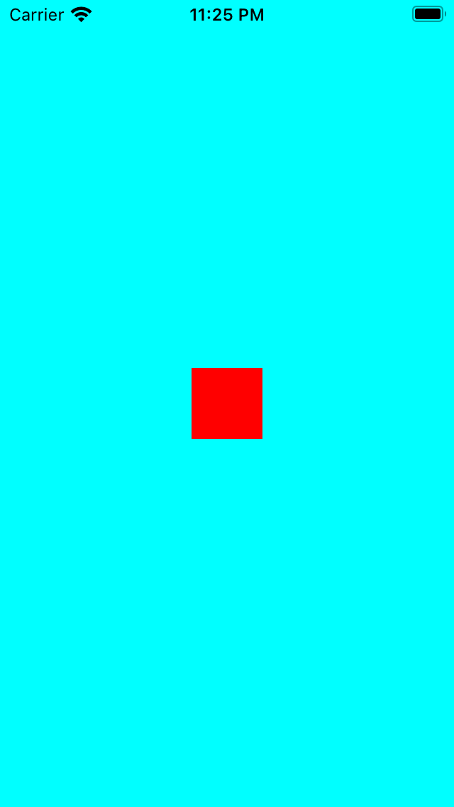
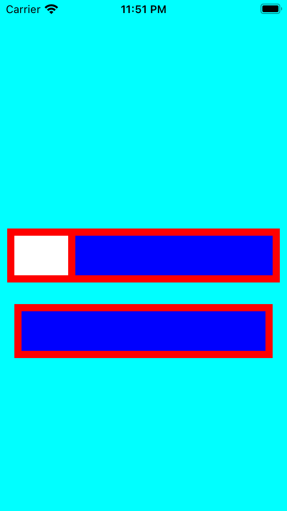

# AutoLayout Extensions

The purpose of this document is to explain the AutoLayout extensions added in this project and how to use them.

## AddSubview helper methods
* [Reference in the codebase](../SwiftyPick/Presentation/Extension/UIView+AddSubview.swift)
* [Tests](../SwiftyPickTests/Presentation/Extension/UIView+AddSubviewTests.swift)

Here we have two methods:
```swift
@discardableResult 
public func addSubview(
    _ subview: UIView,
    constrainedBy constraints: [NSLayoutConstraint.Attribute: Spacing]
) -> [NSLayoutConstraint]

// This one just overloads the first one using 'insets' as the spacing for [top, trailing, leading, bottom].
@discardableResult 
public func addSubview(
    _ subview: UIView,
    insets: Spacing
) -> [NSLayoutConstraint]
```

So basically, these methods help us to:
* Avoid calling `translatesAutoresizingMaskIntoConstraints = false` for every view we add to the hierarchy.
* Avoid creating (and activating) the array of common constraints when adding a subview (top, leading, trailing, bottom)
* Avoid using negative numbers for [bottom, bottomMargin, trailing, trailingMargin] constraints.

### Usage
```swift
func example1() {
    view.backgroundColor = .cyan

    let childView = UIView()
    childView.backgroundColor = .red
    view.addSubview(childView, insets: .large) // .large is 24pts in this design system
    // Or it's equivalent:
    // view.addSubview(
    //    childView,
    //    constrainedBy: [.top: .large, .leading: .large, .trailing: .large, .bottom: .large]
    // )
}
```

```swift
func example2() {
    view.backgroundColor = .cyan

    let childView = UIView()
    childView.backgroundColor = .blue
    view.addSubview(
        childView,
        constrainedBy: [.topMargin: .xLarge, .leading: .none, .trailing: .none, .bottom: .small]
    )
}
```

### Screenshots
| Example 1 | Example 2 |
| - | - |
|  |  |

## Pin Constraints Helper Methods
* [Reference in the codebase](../SwiftyPick/Presentation/Extension/UIView+Pin.swift)
* [Tests](../SwiftyPickTests/Presentation/Extension/UIView+PinTests.swift)

In this one we have a bunch of helper methods, but the most important one is the `pin` method:
```swift
@discardableResult 
public func pin(
    _ attribute: NSLayoutConstraint.Attribute,
    to toAttribute: NSLayoutConstraint.Attribute = .notAnAttribute,
    of view2: UIView? = nil,
    relatedBy relation: NSLayoutConstraint.Relation = .equal,
    multiplier: CGFloat = 1,
    constant: CGFloat = 0,
    priority: UILayoutPriority = .required,
    isActive: Bool = true
) -> NSLayoutConstraint
```

This is the method that we will use when we need to apply custom constraints to our views.
Other methods in this extension include:
```swift
* pinSize
* pinWidth
* pinHeight
* pinToCenter
```
Those are just overloads of the main `pin` method.

### Usage
```swift
func example3() {
    view.backgroundColor = .cyan

    let childView = UIView()
    childView.backgroundColor = .red
    view.addSubview(childView)
    childView.pinToCenter()
    childView.pinSize(CGSize(width: 50, height: 50))
}
```

```swift
func example4() {
    view.backgroundColor = .cyan

    let childView = ConditionalView()
    childView.setUp()
    view.addSubview(childView, constrainedBy: [.leading: .small, .trailing: .small])
    childView.centerVertically()

    let childViewWithNoLeftView = ConditionalView()
    childViewWithNoLeftView.setUp()
    view.addSubview(
        childViewWithNoLeftView,
        constrainedBy: [.leading: .medium, .trailing: .medium]
    )
    childViewWithNoLeftView.pin(
        .top,
        to: .bottom,
        of: childView,
        constant: Spacing.large.rawValue
    )
    childViewWithNoLeftView.removeLeftView()
}

// We will use this fake class as an example on how to add constraints with different priorities
class ConditionalView: UIView {
    private let rightView = UIView()
    private let leftView = UIView()

    func setUp() {
        backgroundColor = .red
        pin(height: 60)
        setUpRightView()
        setUpLeftView()
    }

    func removeLeftView() {
        leftView.removeFromSuperview()
    }

    private func setUpRightView() {
        rightView.backgroundColor = .blue
        addSubview(
            rightView,
            constrainedBy: [.top: .small, .bottom: .small, .trailing: .small]
        )
        rightView.pin(
            .leading,
            to: .leading,
            of: self,
            relatedBy: .equal,
            constant: Spacing.small.rawValue,
            priority: .defaultLow
        )
    }

    private func setUpLeftView() {
        leftView.backgroundColor = .white
        addSubview(
            leftView,
            constrainedBy: [.top: .small, .bottom: .small, .leading: .small]
        )
        leftView.pin(width: 60)
        leftView.pin(
            .trailing,
            to: .leading,
            of: rightView,
            relatedBy: .equal,
            constant: -Spacing.small.rawValue,
            priority: .defaultHigh
        )
    }
}
```

### Screenshots
| Example 3 | Example 4 |
| - | - |
|  |  |

## Cherry-Pick the AutoLayout Extensions 🍒
- Grab the methods that you want and paste them inside an UIView extension in your project; or
- Grab the whole files and add them to your project

    * [UIView+AddSubview](../SwiftyPick/Presentation/Extension/UIView+AddSubview.swift)
    * [UIView+Pin](../SwiftyPick/Presentation/Extension/UIView+Pin.swift)
    * [UIView+AddSubviewTests](../SwiftyPickTests/Presentation/Extension/UIView+AddSubviewTests.swift)
    * [UIView+PinTests](../SwiftyPickTests/Presentation/Extension/UIView+PinTests.swift)