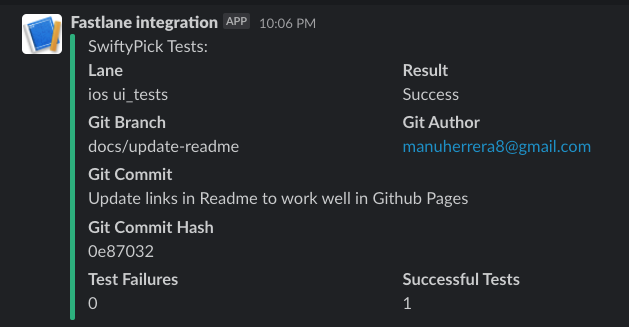

# Fastlane


The purpose of this document is to be a step by step guide on how to integrate Fastlane to your project and use github actions to run the lanes.

* [Getting Started](https://docs.fastlane.tools/getting-started/ios/setup/)

## Cherry-Pick the Github Action for sanity checks 🍒
1. Configure Fastlane in your project following the Getting Started guide mentioned above.
2. Add as many custom actions as you want to the `Fastfile`. The [one](../fastlane/Fastfile) in this project is currently:
    - Running `swiftlint` in strict mode (ie: fails on warnings).
    - Running the `unit tests` in the different TestPlans.
    - Running the `ui tests`.
3. Copy the [workflow](../.github/workflows/fastlane.yml) to your `.github/workflows/` directory.

## Make the tests report to Slack
1. Add a new [Slack Webhook](https://api.slack.com/messaging/webhooks) for your app
2. Add the Webhook url to Github Secrets
3. Pass the secret in the GHA `yml` as an environment variable
```yml
env:
    SLACK_WEB_HOOK_URL: ${{ secrets.SLACK_WEB_HOOK_URL }}
```
4. On the Fastfile, access the env var with:
```yml
ENV['SLACK_WEB_HOOK_URL']
```
5. Add it to the `slack_url` parameter of the `run_tests` lane.


