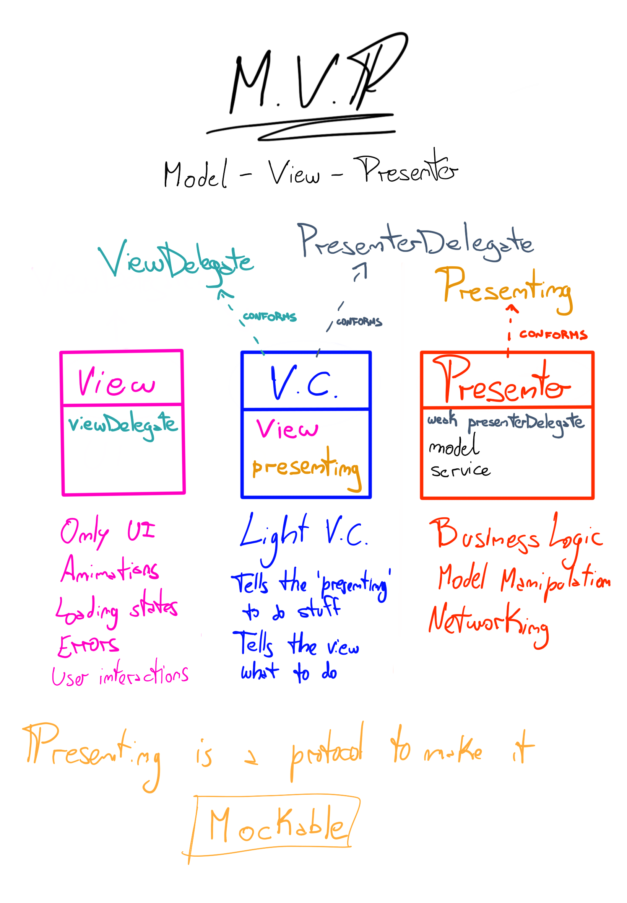

# MVP: UI Design Pattern

The purpose of this document is to explain how to use the MVP (Model-View-Presenter) UI design pattern in your projects.

## Brief overview


The idea behind the MVP pattern is to separate the concerns of each layer and make your code more easily testable.

* `Model` is just the representation of the objects we will display in the UI
* `View` is responsible for the presentation layer (In our case is the VC + the View)
* `Presenter` is the "middle-man" between Model and View. It reacts to the user’s actions performed on the View, retrieves data from the Model, and formats it for display in the View

In the example in this repository we will be making some slight changes to the standard MVP approach to make it a little bit more testable.

Check code samples by navigating to view controllers and presenters in the project.

## Responsibilities

### `Model`
In the Models layer we will store the object structs (or classes) that we need to represent. \
We could also have formatting logic here.
```swift
struct Person {
    let name: String
    let lastName: String
}
```

### `View`
The views only contain UIKit related code. \
You could also add a delegate to communicate stuff to the ViewController if needed.
```swift
// Protocol to tell the ViewController about user actions
protocol YourViewDelegate: AnyObject {
    // Specific method for users tapping on the continue button
    // Follows UIKit API semantics
    func yourView(_ yourView: YourView, didTapContinueButton button: UIButton)
}

final class YourView: UIView {
    weak var delegate: YourViewDelegate?
    ... // AutoLayout configuration / Loading states / Error states / etc
    func continueButtonTapped() {
        delegate?.yourView(self, didTapContinueButton: continueButton)
    }
}
```

### `ViewController`
The view controllers will be very light in this pattern, since all the UIKit code should be in the views. \
Here we will have an instance of the view (that we could set as the viewController.view) and a `Presenting` instance that will be the `Presenter`. \
We will need to conform to the view and presenter delegates in order to react to the events that they send back to the VC.
```swift
final class YourViewController: UIViewController {
    private lazy var yourView = YourView()

    private let presenter: YourPresenting

    init(presenter: YourPresenting = YourPresenter()) {
        self.presenter = presenter
        super.init(nibName: nil, bundle: nil)

        self.presenter.delegate = self
        yourView.delegate = self
    }

    required init?(coder: NSCoder) {
        fatalError("init(coder:) has not been implemented")
    }

    override func loadView() {
        // Here we tell the VC to use `yourView` as it's main view
        self.view = yourView
    }
}

extension YourViewController: YourViewDelegate {
    func yourView(_ yourView: YourView, didTapContinueButton button: UIButton) {
        // When the user tapped the continue button, we start the backend call
        presenter.doBackendCall()
        // We could also tell the view to start loading
        yourView.startLoading()
    }
}

extension YourViewController: YourPresenterDelegate {
    func backendCallFinished(error: Error?) {
        yourView.stopLoading()
        if let error = error {
            yourView.display(error)
            return
        } 

        navigationController?.pushViewController(SuccessViewController(), animated: true)
    }
}
```

### `Presenter`
The presenters will contain all the business logic. \
They will receive actions sent from the VCs and do stuff like networking calls, database queries, model manipulation, etc. \
Whenever they get the result (sync or async) they will let the VC know through the delegate. \
The delegate property must be `weak` in the presenters to avoid reference cycles. \
`Presenting` will be the protocol to which our Presenter will conform, this is in favor of testability. We will be able to replace actual Presenters with MockPresenters that conform to `Presenting` in the tests layer.
```swift
/// YourPresenterDelegate used by the presenter to communicate with the VC.
protocol YourPresenterDelegate: AnyObject {
    func backendCallFinished(error: Error?)
}

/// YourPresenting protocol used in the VC to communicate with the Presenter.
protocol YourPresenting: AnyObject {
    /// The delegate from the presenter to the vc
    var delegate: YourPresenterDelegate? { get set }

    func doBackendCall()
}

/// The Presenter for YourViewController
final class YourPresenter: YourPresenting {
    // weak to avoid reference cycles
    weak var delegate: YourPresenterDelegate?

    func doBackendCall() {
        // Call the backend (This is an async operation)
        yourService.makeRequest { error in
            // Come back to the main thread
            DispatchQueue.main.async {
                self.delegate?.backendCallFinished(error: error)
            }   
        }
    }
}
```

## Testing
By having this separation, we are able to test view controllers with the real presenters or even inject a MockPresenter to avoid dealing with the async code:
```swift
final class YourPresenterMock: YourPresenting {
    weak var delegate: YourPresenterDelegate?
    var doBackendCallsCount = 0

    // Here we will mock whatever we want
    func doBackendCall() {
        doBackendCallsCount += 1
        self.delegate?.backendCallFinished(error: nil)
    }
}

final class YourScreenTests: XCTestCase {
    private var presenter: YourPresenterMock!
    private var vc: YourViewController!
    private var view: YourView!

    override func setUp() {
        super.setUp()
        presenter = YourPresenterMock()
        vc = YourViewController(presenter: presenter)
        view = YourView()
        view.delegate = vc
        vc.loadView()
    }

    override func tearDown() {
        defer { super.tearDown() }
        presenter = nil
        vc = nil
        view = nil
    }

    func testVcAndPresenter() {
        XCTAssert(presenter.delegate === vc)
    }

    func testVcAndView() {
        view.delegate = vc
        XCTAssert(view.delegate === vc)
    }

    func testDoBackendCall() {
        XCTAssertEqual(presenter.doBackendCallsCount, 0)
        view.continueButtonTapped() // This will make the vc call the presenter's doBackendCall method
        XCTAssertEqual(presenter.doBackendCallsCount, 1)
    }
}
```

## Playground
You can also play around with the [Playground file](Assets/MVP/MVP.playground/Contents.swift) and run the tests by yourself.

## Cherry-Pick MVP 🍒
You can start adapting your code to the MVP Design Pattern by looking at the code samples above and creating the Presenters/Views and their protocols. \
Don't forget to add your tests!

## Next
The mocks creation could be automated with a tool like [Sourcery](https://github.com/krzysztofzablocki/Sourcery).
