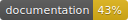

# SwiftyPick 🦅🍒

Useful Swift code samples, extensions, functionalities and scripts to cherry-pick and use in your projects.

## Purpose

The idea behind this project is not to be a `pod` that users import into their own projects, but rather a collection of useful ideas, well-organized and documented, to cherry-pick as needed into another projects.
Every new piece of functionality will have a proper document explaining it's usage under the `Documentation` directory.

## Installation

### SwiftLint
 > `brew install swiftlint`
 
### Configure the Git Hooks
 > `git config core.hooksPath .githooks`
 
### CocoaPods
> Run `pod install` on the root of the project

Open `SwiftyPick.xcworkspace` with Xcode

# Features 🚀

## Code

### Extensions

* [Add support for multiple Color Palettes](Documentation/ColorPalette.md): Easily handle multiple color palettes in your app.
* [AutoLayout helper methods](Documentation/AutoLayout.md): Lightweight classes for declarative auto layout.

### Features

* [SwiftGen](Documentation/SwiftGen.md): Get autogenerated instances of colors, images, and localized strings.

### Networking
* `// TODO //`

### Testing
* [Xcode Test Plans](Documentation/TestPlans.md): Configure different test plans in your project in order to test different configurations.

### UI
* `// TODO //`

### UI Design Patterns
* [MVP](Documentation/MVP.md): Use the MVP design pattern in your project.

## Process

### Danger
* [Danger](Documentation/Danger.md): Configure Danger and add a Github Action to run the script on every PR.

### Documentation
* [Jazzy](Documentation/Jazzy.md): Configure Jazzy to get autogenerated `html` files for documentation.

### Fastlane
* [Fastlane](Documentation/Fastlane.md): Configure Fastlane in your project and add a Github Action to run the tests on every PR to `main`.
* [Run Test Plans on Fastlane](Documentation/TestPlans.md): Configure your fastfile to run different test plans.

### Github

* [Set up PR and Issue templates](Documentation/GithubTemplates.md): How to add a Pull Request or Issue template to your project.
* [Github Actions](Documentation/GithubActions.md): How to add a Github Actions and make them run on Pull Requests.

### SwiftLint

* [SwiftLint](Documentation/SwiftLint.md): How to add and configure SwiftLint rules.

### Scripts

* [Sort Project files alphabetically](Documentation/SortProject.md): Keep the Xcode project files sorted alphabetically and avoid conflicts in the `.pbxproj` file.

# TODOs
This is the list of things I want to add to the project in the near future:

- [ ] UITableViewCell/UICollectionViewCell extension for `register`, `dequeue`, and `cellReuseIdentifier`
- [ ] UserDefaults easy access / FeatureFlags using UserDefaults
- [ ] Logger: Object to log useful information to the console (and to report to analytics/crashlytics)
- [ ] Lightweight `URLSession` networking layer
- [ ] PokedexViewController
    - Use MVP: PokedexPresenter, PokedexPresenting, PokedexPresentingDelegate
    - Use the new networking layer for the backend call
    - Unit test the presenter using a mock presenter to avoid the network call
- [ ] NumberFormatter + Regional unit tests (ie: check the `,` or `.` separator for decimals/thousands depending on the region)
- [ ] CurrencyFormatter + Regional unit tests
- [ ] DateFormatter + Regional unit tests
- [ ] Dynamic Fonts (For accessibility)
- [ ] UITests layer using Page Object pattern
- [ ] Schemes (prod/dev)
- [ ] UIView extension with some basic animations
- [ ] Firebase integration (Analytics/Crashlytics/AB Testing/Flags)
- [ ] Custom Operators from the `Advanced Swift` book
- [ ] GraphQL support
- [ ] Settings view: dark mode, color palette, app icon, local feature flags, display backend calls for debug, change accessibility features, etc

# Contributing

Check out the [Contribution guide](.github/CONTRIBUTING.md)
